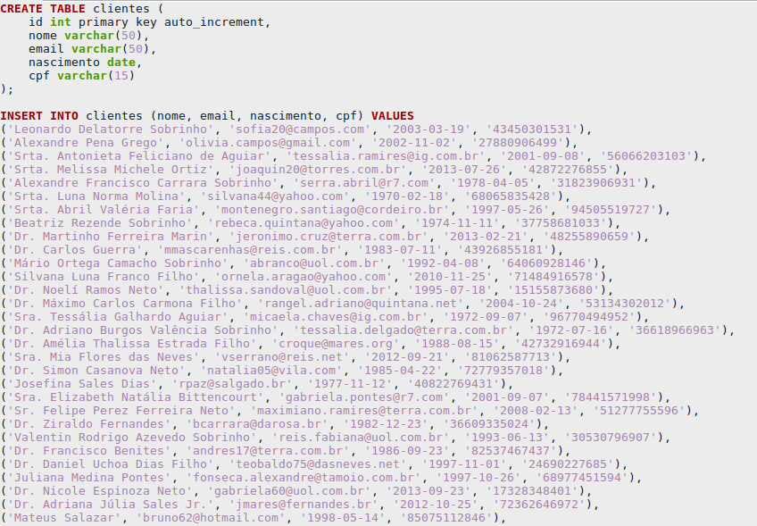

## Geração de um milhão de registros sql aleatórios para testes

# Dizendo não para o lado negro da força (MS) mudei para o GitLab. Manterei os arquivos aqui em respeito aos usuários e ao antigo GitHub mas estarei atualizando somente no GitLab daqui pra frente.
https://gitlab.com/ribafs/data-tests

Generation of one million sql registers random to tests.

Pesquisei várias alternativas para geração de dados/registros de bancos/sql aleatórios para testes.

Fui desde o generatedata.com, passei por stored procedures, pela criação de arquivos sql usando funções do php para gerar strings e datas aleatórias.

O generatedata.com é muito bom mas online somente gera 100 registros e eu quero gerar um milhão.
Stored procedures e funções do php geram dados bem longe de parecer com dados reais.

Acontece que alguém já havia pensado e investido muito neste assunto e foi a melhor alternativa encontrada, a biblioteca Faker:
https://github.com/fzaninotto/Faker

Muitos recursos para o assunto. Ela já tem variáveis e objetos para vários tipos de dados: nome, email, data, endereço, cidade, estado, pais, etc. 

Sem contar que gera dados localizados, bem aprecidos com dados reais, com nomes brasileiros, por exemplo.
É tanto que esta bibliteca atualmente é utilizada por diversos frameworks.

## Instalação do Faker

Requer o composer instalado globalmente

mkdir /var/www/html/faker

cd /var/www/html/faker

composer require fzaninotto/faker

Agora crie o arquivo acima como index.php na pasta onde instalou o faker, contendo o código para geração dos registros.

Demora para criar o arquivo com um milhão de registros, dependendo do computador demora mais ou menos
Num micro com 4GB de RAM, core i3 ele demorou 20 minutos para gerar o arquivo.

Quanto alterei para usar pt_BR o tempo aumentou para 26 minutos e o tamanho do arquivo de 76MB para 86MB.
Mas valeu a pena pois a opção localizada gera dados mais parecidos com os nossos reais no Brasil.

Para dar uma ideia: para abrir o arquivo no gedit levou 4 minutos.

## Exemplos de uso em php

million.php - https://raw.githubusercontent.com/ribafs/data-testes/master/million.php

anothers.php - https://raw.githubusercontent.com/ribafs/data-testes/master/anothers.php

Após gerar um milhão de registros veja como ficou o início do arquivo:

## Pacotes prontos

Para quem quizer usar s pacote que eu gerei, com 300.000 registros e 1 milhão:

Um milhão de registros - https://raw.githubusercontent.com/ribafs/data-testes/master/million.sql.7z

300.000 registros - https://raw.githubusercontent.com/ribafs/data-testes/master/clientes_300_000.zip

## Dica Extra

Se por algum motivo quizer gerar datas no formato usado no Brasil use:

print $faker->date($format = 'd/m/Y', $max = 'now');

## Importando o Script

Uma forma simples de importar este script é fazendo pelo terminal:

- Copiar ele para um certo diretório
- Descompactar
- Abrir o terminal e executar (supondo importar para o banco cadastro):

mysql -uroot -p cadastro < clientes.sql

Outra forma é usando o adminer (http://adminer.org)

Editar o adminer.php e inserir as linhas abaixo (logo abaixo do <?php):

ini_set('max_execution_time', '-1');// Ilimitados
ini_set('max_input_time', 120);// s
ini_set('max_input_nesting_level', 64);//s
ini_set('memory_limit', '-1');//Ilimitada?

Para importar pelo phpmyadmin precisa ajustar o php.ini de acordo com as 4 linhas acima

## Observação

Quase desnecessário dizer mas da mesma forma que criei um script sql compatível com o MySQL podemos gerar para qualquer outro SGBD apenas seguindo dua sintaxe.

Como também que a quantidade de registros gerada é livre, tanto podemos gerar uma quantidade menor quanto uma maior que um milhão. Lembrando apenas de usar o número abaixo sendo um a menos que o primeiro.

## Problema de codificação de caracteres

Mesmo usando o comando para codificação UTF-8 no início do arquivo, ainda assim alguns nomes aparecem com problema no acento.
Descobri. Aconteceu de criar o banco com latin1 e importar a tabela como UTF-8.
Então lembre de criar o banco com UTF-8, recomendo utf8mb4_unicode_ci para evitar problemas com acentuação.

Mesmo em um banco com UTF-8 o problema da acentuação ainda persistia. Então resolvi adicionando charset na linha da conexão com o banco:

$dsn = $this->sgbd.':host='.$this->host.';dbname='.$this->db.';charset=utf8';

## Licença

MIT
